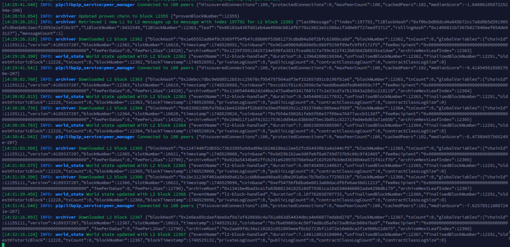
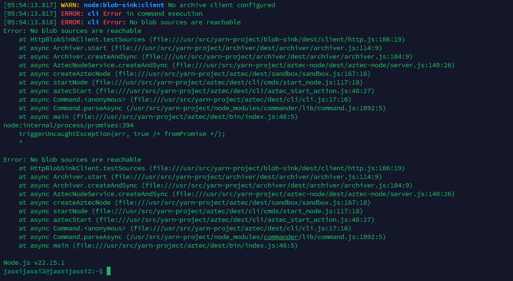
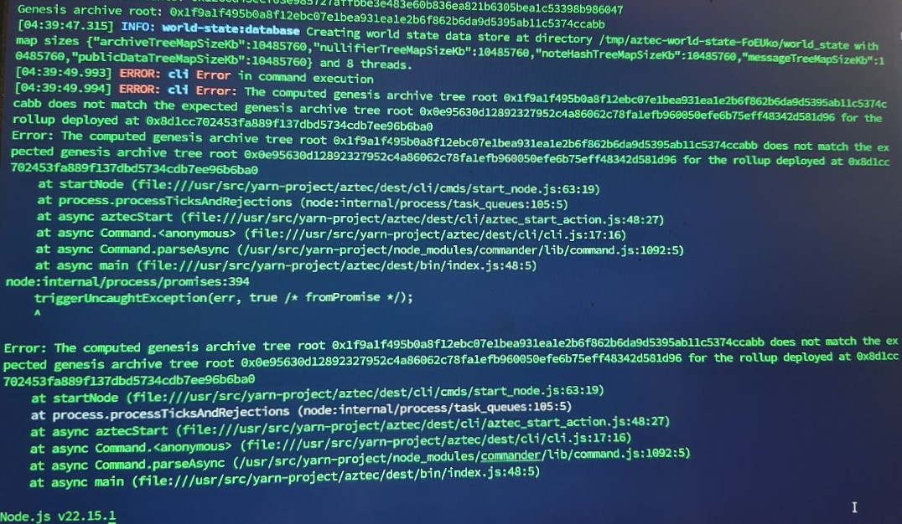
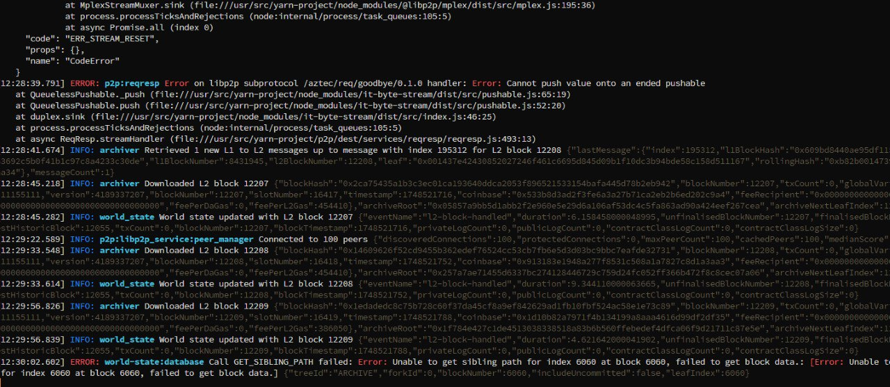
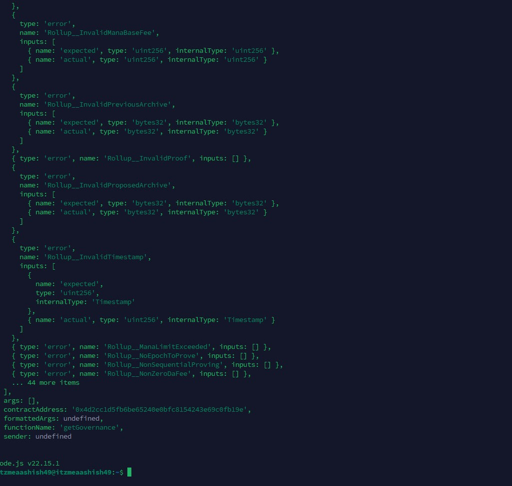

# 🚀 Aztec Node Setup Guide

Welcome! This guide will walk you through installing and running an Aztec node on your server or VPS. Follow each step carefully, and you'll be up and running in no time!

---

## 🛠️ System Preparation

Update and upgrade your system:
```bash
sudo apt-get update && sudo apt-get upgrade -y
```

Install Node.js 20:
```bash
curl -fsSL https://deb.nodesource.com/setup_20.x | sudo -E bash -
sudo apt update
sudo apt install -y nodejs
```

Install essential packages:
```bash
sudo apt install curl iptables build-essential git wget lz4 jq make gcc nano automake autoconf tmux htop nvme-cli libgbm1 pkg-config libssl-dev libleveldb-dev tar clang bsdmainutils ncdu unzip libleveldb-dev screen ufw -y
```

---

## 🐳 Install Docker & Docker Compose

Install Docker:
```bash
sudo apt update && sudo apt install -y apt-transport-https ca-certificates curl software-properties-common
curl -fsSL https://download.docker.com/linux/ubuntu/gpg | sudo gpg --dearmor -o /usr/share/keyrings/docker-archive-keyring.gpg
echo "deb [arch=amd64 signed-by=/usr/share/keyrings/docker-archive-keyring.gpg] https://download.docker.com/linux/ubuntu $(lsb_release -cs) stable" | sudo tee /etc/apt/sources.list.d/docker.list > /dev/null
sudo rm -rf /var/lib/apt/lists/* && sudo apt clean && sudo apt update --allow-insecure-repositories
sudo apt install -y docker-ce
sudo systemctl enable --now docker
sudo usermod -aG docker $USER && newgrp docker
```

Install Docker Compose:
```bash
sudo curl -L "https://github.com/docker/compose/releases/download/$(curl -s https://api.github.com/repos/docker/compose/releases/latest | jq -r .tag_name)/docker-compose-$(uname -s)-$(uname -m)" -o /usr/local/bin/docker-compose
sudo chmod +x /usr/local/bin/docker-compose
```

---

## ⚡ Install Aztec CLI

```bash
bash -i <(curl -s https://install.aztec.network)
echo 'export PATH="$HOME/.aztec/bin:$PATH"' >> ~/.bashrc
source ~/.bashrc
```

Set correct version for testnet:
```bash
aztec-up alpha-testnet
```

---

## 🔓 Allow Incoming Connections

```bash
sudo ufw allow 22
sudo ufw allow ssh
sudo ufw enable
sudo ufw allow 40400
sudo ufw allow 8080
```
> _Press `Y` when prompted._

---

## 🔑 Get Sepolia & Beacon API Keys

- [Rockx](https://access.rockx.com/)
- [BlockPi](https://blockpi.io/)
- [Drpc](https://drpc.org/)
- [Chainstack](https://console.chainstack.com/projects/)
- [Ankr](https://www.ankr.com/)
- [Tenderly](https://dashboard.tenderly.co/)

Or create your own RPC (video guide coming soon).

---

## 🟢 Start Your Sequencer

Create a screen session (for VPS):
```bash
screen -S aztec
```

Start your node (replace placeholders!):
```bash
aztec start --node --archiver --sequencer \
    --network alpha-testnet \
    --l1-rpc-urls Eth_Sepolia_RPC \
    --l1-consensus-host-urls Beacon_sepolia_RPC \
    --sequencer.validatorPrivateKey 0xYourPrivateKey \
    --sequencer.coinbase YourAddress \
    --p2p.p2pIp Your_ip
```
- Replace `Eth_Sepolia_RPC` and `Beacon_sepolia_RPC` with your actual RPC URLs.
- Replace `0xYourPrivateKey` with your EVM wallet private key (with `0x` prefix).
- Replace `YourAddress` with your EVM wallet address (fund it with Sepolia ETH).
- Replace `Your_ip` with your external IP (`curl ifconfig.me`).

> _It will take some time to sync. Successful syncing looks like this:_
>
> 


**For VPS users:**  
Detach screen: `Ctrl + A + D`  
Reattach: `screen -r aztec`

---

## 🏅 Discord Roles

Join [Aztec Discord](https://discord.gg/aztec)

### 1. Get Apprentice Role

**Step 1:** Get the latest block number:
```bash
curl -s -X POST -H 'Content-Type: application/json' \
-d '{"jsonrpc":"2.0","method":"node_getL2Tips","params":[],"id":67}' \
http://localhost:8080 | jq -r ".result.proven.number"
```
_Save the output (e.g., `12345`)._

**Step 2:** Generate your proof (replace `BLOCK_NUMBER`):
```bash
curl -s -X POST -H 'Content-Type: application/json' \
-d '{"jsonrpc":"2.0","method":"node_getArchiveSiblingPath","params":["BLOCK_NUMBER","BLOCK_NUMBER"],"id":67}' \
http://localhost:8080 | jq -r ".result"
```
_Copy and save the base64 string._

**Step 3:**  
Go to `#operators│start-here` channel, type `/operator start`, and enter your address, block number, and proof.

---

### 2. Get Guardian Role

- Run your node for a week.
- After the snapshot, check your role:
    - Go to `# Upgrade-Role` channel.
    - Type `/checkip` and enter your IP and ETH address.

---

##                  ❓ FAQ & Troubleshooting

### 1. No Blob Sources Are Reachable



**Why:**  
Incorrect command format while starting the node.

**Solution:**  
Use the correct `aztec start` format:

```bash
aztec start --node --archiver --sequencer \
  --network alpha-testnet \
  --l1-rpc-urls <Eth_Sepolia_RPC> \
  --l1-consensus-host-urls <Beacon_Sepolia_RPC> \
  --sequencer.validatorPrivateKey 0x<Your_Private_Key> \
  --sequencer.coinbase <Your_EVM_Address> \
  --p2p.p2pIp <Your_IP>
```

**🔁 Replace Carefully:**

- `<Eth_Sepolia_RPC>` → Your actual Sepolia RPC
- `<Beacon_Sepolia_RPC>` → Your Beacon Sepolia RPC
- `0x<Your_Private_Key>` → EVM wallet private key (with `0x`)
- `<Your_EVM_Address>` → Funded Sepolia address (get from [Faucet](https://sepolia-faucet.pk910.de/))
- `<Your_IP>` → VPS IP (`curl ifconfig.me`)

Make sure all fields are valid — this will fix the "No Blob Sources" error.

---

### 2. TempData Issue



**Why:** Old temp data.

**Solution:**
```bash
sudo rm -rf /tmp/aztec-world-state-*
```
_Then, Restart your node and it'll be fixed._

---

### 3. Error While Running



**Why:** Due To RPC load.

**Solution:**  
> ⚠️ Seeing some errors while syncing? Don't worry — it's normal **if blocks are syncing**.

> 🚫 Only errors and **no success blocks**? Try changing your RPC.


---

### 4. Undefined Error



---

## ❓ Why does this happen?

This error usually occurs due to **RPC** or **Port** issues. Your node or RPC endpoint might not be accessible because the required ports are not open or firewall rules are blocking the connection.

---

## 🛠️ Solution

### **A. If you created your own RPC**

1. **Open Required Ports on Both VPS (RPC & Node):**

    ```bash
    sudo ufw allow 30303/tcp && sudo ufw allow 30303/udp && sudo ufw allow 8545/tcp && sudo ufw allow 8546/tcp && sudo ufw allow 8551/tcp && sudo ufw allow 4000/tcp && sudo ufw allow 3500/tcp && sudo ufw enable && sudo ufw status
    ```

2. **Configure Google Cloud Firewall:**

    - Go to [Firewall Rules](https://console.cloud.google.com/networking/firewalls)
    - Click **Create Firewall Rule**
    - Fill in the following:

      | Field              | Value                                      |
      |--------------------|--------------------------------------------|
      | Name               | allow-rpc-access                           |
      | Network            | default (or your VPC name)                 |
      | Priority           | 1000                                       |
      | Direction          | Ingress                                    |
      | Action             | Allow                                      |
      | Targets            | Specified target tags                      |
      | Target tags        | allow-rpc                                  |
      | Source IP ranges   | 0.0.0.0/0                                  |
      | Protocols and ports| tcp:8545-8551,30303, udp:30303             |

    - Click **Create**

3. **Tag Your Instance:**

    - Go to [Compute Instances](https://console.cloud.google.com/compute/instances)
    - Click your VPS1 instance → **Edit**
    - Scroll to **Network tags** → add: `allow-rpc`
    - Click **Save**

4. **Try running your node again!**  
    _Your issue should be fixed._

---

### **B. If you bought the RPC and still face this issue**

1. **Open Required Ports:**

    ```bash
    sudo ufw allow 30303/tcp && sudo ufw allow 30303/udp && sudo ufw allow 8545/tcp && sudo ufw allow 8546/tcp && sudo ufw allow 8551/tcp && sudo ufw allow 4000/tcp && sudo ufw allow 3500/tcp && sudo ufw enable && sudo ufw status
    ```

2. **Try running your node again.**  
    _If it still doesn't work, try changing your RPC provider._

---

## 🧑‍💻 Get Your Peer ID (via VPS)

1. **Create Firewall Rule for Docker Peer Ports:**

    - Go to [Firewall Policies](https://console.cloud.google.com/net-security/firewall-manager/firewall-policies/)
    - Name: `allow-docker-ports`
    - Targets: All instances (or use target tags)
    - Source IP ranges: `0.0.0.0/0` (or restrict to your IP)
    - Protocols and ports:  
      - ✅ Check **Specified protocols and ports**
      - Enter:  
         ```
         tcp:40400,
         udp:40400
         ```
    - Click **Create**

2. **Get Peer ID:**

    ```bash
    sudo bash -c "docker logs \$(docker ps -q --filter ancestor=aztecprotocol/aztec:alpha-testnet | head -n 1) 2>&1 | grep -i 'peerId' | grep -o '\"peerId\":\"[^\"]*\"' | cut -d'\"' -f4 | head -n 1"
    ```

    - This will output your **Peer ID** (starts with `16...`).  
    - **Copy and save it!**

---

## 🔍 Verify & Explore

- Check your Peer ID and node details here:  
  👉 [Aztec Web Explorer](https://aztec.nethermind.io/explore)

---


> 💬 **Need help?** Reach out: [@Legend_Aashish](https://t.me/Legend_Aashish)  

> 📺 **All guides, videos & updates:** [@Hustle_Airdrops](https://t.me/Hustle_Airdrops)  
> 🚀 **Stay ahead — join the channel now!**

---
